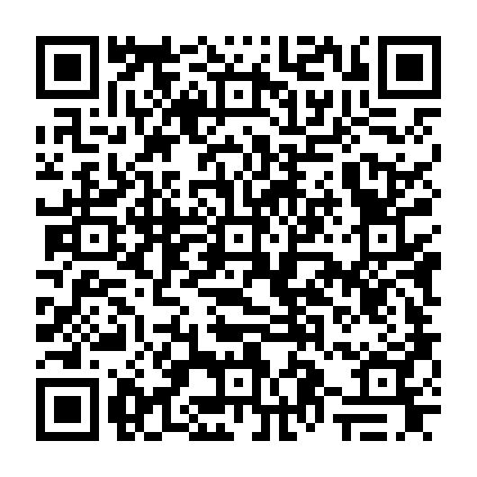

---
# Feel free to add content and custom Front Matter to this file.
# To modify the layout, see https://jekyllrb.com/docs/themes/#overriding-theme-defaults

layout: single 
title: Syllabus      
lang: us   
ref: syl   
permalink: /   
toc: true  
toc_label: "Syllabus Contents" 
toc_icon: "book-open"  
toc_sticky: true   
read_time: true  
show_date: true  
date_format: "%Y-%m-%d"  
date: 2025-08-25  
last_modified_at: 2025-08-25   

---

<!-- <link rel="stylesheet" href="https://cdn.jsdelivr.net/gh/lipis/flag-icons@6.11.0/css/flag-icons.min.css"/>

  
  
    <li class="zoom"><a href="/MUS218A-Soundscapes-FA2025{{ page.url }}" class="{{ page.lang }}"></a></li>
  

  <i class="fas fa-book-open fa-2x"></i>

 -->

<mark>As of August 25, 2025, this site is under construction as we approach the start of our semester. Once the Syllabus and Schedule have been fully updated, this banner will disappear.</mark>

## 1. Essential Contact Information  

**Course Number:** MUS218A   
**Semester:** Fall 2025   
**Time:** Mondays, Wednesdays, and Fridays from 14:40—16:00     
**Location:** Bates Sound Studio (Olin 302)  
**Format:** Lecture/Demonstration    
**Modality:** In-person   
**Modes of Inquiry**: \[CP\]    
**Writing Credit**: None     
**GEC(s)**: GEC C005      
<!-- <em><b>* hybrid and virtual available in extenuating circumstances at the discretion of the instructor</b></em>    -->

**Instructor:** Prof. Dr. Louis Goldford  
**Email:** <a href="mailto:lgoldford@bates.edu">lgoldford@bates.edu</a>  
**Office Hours:** Wednedsays from 11:00—12:30 or by appointment.    
**Office Location:** Olin 260   
<!-- **MHL Discord Server:** [https://discord.gg/ZQWrjtwq](https://discord.gg/ZQWrjtwq){:target="_blank"}       -->

**Studio Assistant:** Milo Gold  
**Email:** <a href="mailto:mgold2@bates.edu">mgold2@bates.edu</a>  
**Studio Hours:** Tuesdays 14:00—16:00 and Thursdays 14:00—15:00      

**Course Website:** [https://einbahnstrasse.github.io/MUS218A-Soundscapes-FA2025/](https://einbahnstrasse.github.io/MUS218A-Soundscapes-FA2025/){:target="_blank"}  

_Our course website, and especially its [Schedule page](/MUS218A-Soundscapes-FA2025/schedule/){:target="_blank"}, will be used to distribute course materials while all grading and assignment submissions will take place through Lyceum and Etna. You will need to consult this site before each class to keep up with our daily materials, changes to our schedule, etc. If you're viewing this Syllabus on a projected screen, bookmark our site at the following link:_   

<!--     -->

    
## 2. Course Description    

This course focuses on the creative acts of recording and sound design. Technical topics covered include recording (both studio and experimental techniques), microphone placement, editing and mixing in REAPER (an open source software), effects and digital processing, and sound design for stereo and multitrack speaker arrays. Creative assignments improve listening skills, foreground aural experience, increase awareness of sonic environments, and sharpen skills related to the use of sound as a sensory and communication medium. Listening and reading assignments support creative and technical concepts covered. Students generate three to four new, original sound-based works during the course of the semester, one of which is refined for a final public listening session. Recommended background: interest in or experience with music, sound, or digital media.

**Soundscapes: Recording and Designing Sound** is a first-semester foundational course in electronic music and sound art, introducing students to the studio environment and to the rudiments of recording, mixing, post production, synthesis and MIDI, computer music, and spatial audio. This semester will focus on **multichannel fixed media composition**.  

Class sessions are structured with an emphasis on creating, transforming, and sculpting sounds. Classes will frequently consist of software tutorials and in-class demonstrations that can quickly be integrated into personal artistic projects. Students will be required to complete a number of smaller graded assignments, culminating in a final piece. Each week focuses on a new topic that builds upon work completed in the previous week. _**Students are therefore expected to attend regularly.**_ There is a **midterm exam**: a 3-minute stereo fixed media "sketch." This sketch can be expanded upon and made into the **final exam**: a 6-8-minute multichannel work for a concert held on December 2nd. **Students are required to attend and present their work on December 2, 2025 from 7:30—9:30**, with sound checks earlier in the day.       

### 2.1 Course Goals      

This course will equip students with the basic protocols of working in a studio enviornment, acquainting them with the fundamnetals of acoustics and sound, digital audio, an overview of the history of techniques for analog and digital audio synthesis, and will provide direct, hands-on experience creating multichannel electronic music in a Digital Audio Workstation (DAW), as well as an inroduction to the MaxMSP real-time audio and synthesis environment. 
  
### 2.2 Learning Outcomes  

_By the end of the course, students will be able to:_  

1. **implement** and **demonstrate** the tools of fixed media composition within an artistic workflow  
2. **classify** and **identify** a variety of synthesis methods      
3. **identify**, **critique**, and **experiment** with differing approaches to sound synthesis  
4. **compare** and **contrast** real-time and offline synthesis methodologies   
5. **assemble** an array of preferred tools into a personal creative coding practice, including a logical debugging process  

### 2.3 Software + Hardware    

_See the [RESOURCES TAB](/MUS218A-Soundscapes-FA2025/resources){:target="_blank"} for download and documentation links._  

Although no specific requirement exists for hardware, the following are strongly recommended. Students who do not have access to some or all of these are encouraged to enroll and to make ample use of the Bates Sound Studio facilities, where they can use its compputers to complete all assignments. 

1. personal laptop  
2. headphones  
3. external hard drive _(or cloud storage to back up your files)_  
4. Reaper (open source software) 
5. Ableton Live Suite (premium software, optional) 
6. SpatGRIS (open source software)   
7. MaxMSP (premium software, but only utilized during a free trial period) 
8. Google Chrome or any web browser that will allow you to access our Course Website & materials   
9. various other plugins and apps listed throughout the semester (open source software)  
  
## 3. Expectations   

### 3.1 General Expectations   

1. **Arrive on time** to all course sessions.  
2. Spend **2-4 additional hours per week** _(outside of class)_ on the timely completion of our assignments and projects.  
3. Submit assignments by the given deadlines on Lyceum.   
4. **Back up and organize your work REGULARLY.** _Catastrophic loss of materials is not, unfortunately, an excuse for missed deadlines!_  

### 3.2 Weekly Preparation      

1. **Study video tutorials, slides, readings, and other assigned materials ahead of class.** Come prepared with clarifying questions.  
2. We will devote the majority of our class time to demonstrating and creating, and therefore **we will be unable to present videos, slides, and readings in class.** Familiarize yourself with this background content beforehand so that you are not lost. Most likely, we will not reference at least some of these materials directly during our class session.   
3. Additionally, it is strongly encouraged that you **consult the recommended software documentation resources**. These provide context and will deepen your understanding as you build your own systems and creative tools.  

### 3.3 Communication   

1. Weekly class sessions will be held in the Bates Sound Studio. Questions can easily be addressed during, as well as before and after, our class.   
2. Bates email accounts are our official means of communication.  
3. **Requests for assistance:** Send an email to the instructor and studio assistant. I will respond during normal working hours; requests arriving "after hours" will be answered on subsequent weekdays.  
4. **Actively participate** in our class discussions. **Thoughtfully contribute to a positive classroom environment,** while supporting and challenging your colleagues’ ideas.  
   
### 3.4 Self-Guided Work  

1. All students are responsible for building each of our DAW sessions (e.g., in Reaper) and each of our pedagogical patches (e.g., in MaxMSP) **by themselves**, regardless of whether a student needs to be absent or late from any class session. 
2. This policy fosters a habit of **personal practice** using our software and **promotes self-guided learning** and **understanding**.  
3. Students are also responsbile for producing their **own work** throughout the class, including their own builds of our pedagogical patches, DAW sessions, and sample recordings, in accordance with our [Academic Integrity Policy](#academic-integrity-policy) below.  
4. Direct copies or clones of other people's creative work are evident in the line-by-line code of the software itself, and are therefore easily traceable. 
5. Students should rely on our **seminar discussions**, **demonstration notes and software comments**, **office hours**, software **documentation**, **help files**, and **user forums** to actively troublehsoot and **debug** issues that will naturally arise during the learning process and interactions with new software. _Many folks learn best this way: as they rapidly problem solve and troubleshoot their project work._   
6. By adopting this policy, we avoid fostering a habit of **relying on others' code**: that is, by constantly borrowing from colleagues or forums without learning to understand the software's underlying functionality.  
7. This policy is **not to enforce copying or mimicking**, but rather to promote **reasoning through the course materials** and adopting its utilization **as template and boiler documents**; that is, as a basis for future work, aimed at **building independence and creativity**. At its core, this policy combats the habit of **copying code** without understanding its functionality.         
8. At first, students may **progress slowly** through this process. However, just like learning to drive a car, students will become more efficient and faster over time, especially as they **optimize their software routine** and **build resourcefulness**. Through our class work and projects, students **will learn to solve problems faster**, to actively seek solutions from the best resources for any given task, and to find resolution in an efficient, self-guided manner.   

### 3.5 Attendance + Participation Policy   

_Your participation is based on attendance and your engagement in class, and will form a substantial portion of your grade._   

* German law requires that you **attend a minimum of 80% of all class sessions** in order to pass this class. 
* This means **you can miss up to 3 class sessions**.  
* However, missing a class should be avoided when possible. In a skills-building music technology course such as this one, we must ensure that you are up-to-date on our materials each week — partly because the next week will often build on the materials covered last week.  
* Missing _more than_ 3 class sessions will result in a grade reduction or possibly a failure of the course, depending on whether a student satisfies additional makeup work assigned by the instructor. In this scenario, the student completes all Max patching, assignments, projects, and any additional material assigned by the instructor to help ensure understanding or evaluation of progress. Additional materials may, in some cases, require the student to attend periodic check-in meetings with the instructor to ensure the student understands material missed in class. Failure to meet with the instructor to evaluate progress in such a circumstance will result in a grade reduction if progress is otherwise not demonstrated in the student's submitted work.  

#### 3.5.1 Prompt Arrival   

1. Students are expected to arrive promptly to all class sessions and remain engaged throughout.  
2. On-time arrivals earn you an immediate 5 points (full participation).   
3. Arrivals after 14:30 trigger the following weighted score system:

<table>
<colgroup>
<col width="30%" />
<col width="70%" />
</colgroup>
<thead>
<tr class="header">
<th>Arrival Time</th>
<th>Participation Points</th>
</tr>
</thead>
<tbody>
<tr>
<td markdown="span">10:00 or earlier</td>
<td markdown="span">5 points (full credit)</td>
</tr>
<tr>
<td markdown="span">10:01—10:10</td>
<td markdown="span">4 points</td>
</tr>
<tr>
<td markdown="span">10:11—10:30</td>
<td markdown="span">3 points</td>
</tr>
<tr>
<td markdown="span">10:31—10:45</td>
<td markdown="span">2 points</td>
</tr>
<tr>
<td markdown="span">after 10:45</td>
<td markdown="span">1 point</td>
</tr>
<tr>
<td markdown="span">absent</td>
<td markdown="span">0 points</td>
</tr>
</tbody>
</table>

#### 3.5.2 Absences   

##### 3.5.2.1 Procedure for Absences      

* Students are responsible for completing the same work outside of class that was assigned or completed in class.   
* If you must be absent for any reason, regardless of whether that absence is excused or unexcused, follow this **Procedure for Absences:**   

  1. Check our [Schedule](/schedule){:target="_blank"} for assignments, videos, slides, readings, etc.   
  2. Contact a classmate for **patch screenshots** and **notes** on what you missed (e.g. on Discord) _(in accordance with [3.5.2.3 Sharing Patch Screenshots (MaxMSP)](#3523-sharing-patch-screenshots-maxmsp) below)._   
  3. After these first 2 steps, contact the instructor with any additional questions.   

* **Absences/tardiness must be accompanied by documentation** and/or include advance notice with the instructor. Absences/tardiness will not impact on your grade if they are reported in advance and if they are infrequent. Absences will be excused in cases of: documentation of illness provided by a doctor's note, religious observance with advance notice, official school-related activity (always with documentation and advanced notice), and on a case-by-case basis for other critical events, at the discretion of the instructor.  
* Planned absences should be reported to the instructor by our Week 3 class _(see our [Schedule](/schedule){:target="_blank"} page)._   
* _A lack of communication with the instructor about planned absences will therefore be treated as **unexcused**. Be in touch early._   
* **Absences and lateness may result in a lack of understanding of our materials, which will become evident in your project and/or exam work, and therefore will result in lower exam and project scores.** 

##### 3.5.2.2 Required Check-In Meetings   

* A student absent for **a single seminar** need only follow the [Procedure for Absenses](#3521-procedure-for-absences) outlined above.  
* A student missing **2 seminars** must additionally **schedule a half-hour office hour appointment**, designated as a **Check-In Meeting**, according to instructor availability outlined in [Essential Contact Information](#1-essential-contact-information) above.  
* Check-In Meetings are necessary to ensure understanding of our course content and to plan alternative work for missed class time.  
* **Every 2 absences will require a new Check-In Meeting**.  
* _**NOTE:** Instructor availability is limited and available on a first-come-first-serve basis. I will not always be available due to my additional teaching and other events. Availability for Check-In Meetings, therefore, **is not guaranteed!** Students must coordinate around the instructor's availability if they choose to be absent from multiple seminars. Failure to scheudle or attend the required number of Check-In Meetings is  firmly the responsibility of the student and will result in lowered participation grades for the semester._  
* Students should, therefore, strive to attend all seminars, or as many as possible, in person.  

##### 3.5.2.3 Sharing Patch Screenshots (MaxMSP)   

1. In accordance with [3.4 Self-Guided Work](#34-self-guided-work) above, students should **never share their patches** (.maxpat) with one another. 
2. Rather, students should **only share screenshots** of their work. In other words, all students should build each of the pedagogical patches by themselves.   
3. See [How to take a screenshot on a Mac or PC](https://reviewed.usatoday.com/laptops/features/how-to-take-a-screenshot-on-mac-and-pc){:target="_blank"} for further details.   

## 4. General Schedule of Topics   

_Please note: Our schedule of topics and their precise order may change._  
_See the [SCHEDULE TAB](schedule/){:target="_blank"} for a precise weekly breakdown._  
_For a detailed list of assignments, points, and deadlines, see the [GRADING TAB.](grading.html){:target="_blank"}_  

<table>
<colgroup>
<col width="5%" />
<col width="15%" />
<col width="80%" />
</colgroup>
<thead>
<tr class="header">
<th>Week</th>
<th>Date</th>
<th>Topic(s)</th>
</tr>
</thead>
<tbody>
<tr>
<td markdown="span">1</td>
<td markdown="span">{{ site.week-01 }}</td>
<td markdown="span"><a href="schedule/#w1" target="_blank">{{ site.week-01-topic }}</a></td>
</tr>
<tr>
<td markdown="span">2</td>
<td markdown="span">{{ site.week-02 }}</td>
<td markdown="span"><a href="schedule/#w2" target="_blank">{{ site.week-02-topic }}</a></td>
</tr>
<tr>
<td markdown="span">3</td>
<td markdown="span">{{ site.week-03 }}</td>
<td markdown="span"><a href="schedule/#w3" target="_blank">{{ site.week-03-topic }}</a></td>
</tr>
<tr>
<td markdown="span">4</td>
<td markdown="span">{{ site.week-04 }}</td>
<td markdown="span"><a href="schedule/#w4" target="_blank">{{ site.week-04-topic }}</a></td>
</tr>
<tr>
<td markdown="span">5</td>
<td markdown="span">{{ site.week-05 }}</td>
<td markdown="span"><a href="schedule/#w5" target="_blank">{{ site.week-05-topic }}</a></td>
</tr>
<tr>
<td markdown="span">6</td>
<td markdown="span">{{ site.week-06 }}</td>
<td markdown="span"><a href="schedule/#w6" target="_blank">{{ site.week-06-topic }}</a></td>
</tr>
<tr>
<td markdown="span">7</td>
<td markdown="span">{{ site.week-07 }}</td>
<td markdown="span"><a href="schedule/#w7" target="_blank">{{ site.week-07-topic }}</a></td>
</tr>
<tr>
<td markdown="span">8</td>
<td markdown="span">{{ site.week-08 }}</td>
<td markdown="span"><a href="schedule/#w8" target="_blank">{{ site.week-08-topic }}</a>
</td>
</tr>
<tr>
<td markdown="span">9</td>
<td markdown="span">{{ site.week-09 }}</td>
<td markdown="span"><a href="schedule/#w9" target="_blank">{{ site.week-09-topic }}</a></td>
</tr>
<tr>
<td markdown="span">10</td>
<td markdown="span">{{ site.week-10 }}</td>
<td markdown="span"><a href="schedule/#w10" target="_blank">{{ site.week-10-topic }}</a></td>
</tr>
<tr>
<td markdown="span">11</td>
<td markdown="span">{{ site.week-11 }}</td>
<td markdown="span"><a href="schedule/#w11" target="_blank">{{ site.week-11-topic }}</a></td>
</tr>
<tr>
<td markdown="span">12</td>
<td markdown="span">{{ site.week-12 }}</td>
<td markdown="span"><a href="schedule/#w12" target="_blank">{{ site.week-12-topic }}</a></td>
</tr>
<tr>
<td markdown="span">13</td>
<td markdown="span">{{ site.week-13 }}</td>
<td markdown="span"><a href="schedule/#w13" target="_blank">{{ site.week-13-topic }}</a></td>
</tr>
<tr>
<td markdown="span">14</td>
<td markdown="span">{{ site.week-14 }}</td>
<td markdown="span"><a href="schedule/#w14" target="_blank">{{ site.week-14-topic }}</a></td>
</tr>
<tr>
<td markdown="span">15</td>
<td markdown="span">{{ site.week-15 }}</td>
<td markdown="span"><a href="schedule/#w15" target="_blank">{{ site.week-15-topic }}</a></td>
</tr>
<tr>
<td markdown="span">16</td>
<td markdown="span">{{ site.week-16 }}</td>
<td markdown="span"><a href="schedule/#w16" target="_blank">{{ site.week-16-topic }}</a></td>
</tr>
<tr>
<td markdown="span">17</td>
<td markdown="span">{{ site.week-17 }}</td>
<td markdown="span"><a href="schedule/#w17" target="_blank">{{ site.week-17-topic }}</a></td>
</tr>
<tr>
<td markdown="span">18</td>
<td markdown="span">{{ site.week-18 }}</td>
<td markdown="span"><a href="schedule/#w18" target="_blank">{{ site.week-18-topic }}</a></td>
</tr>
</tbody>
</table>

   
## 5. Academic Integrity Policy    

### 5.1 General Notes on Academic Integrity   

Students and all others who work with information, ideas, texts, images, music, inventions, code, and other intellectual property owe their audience and sources accuracy and honesty in using, crediting, and citing sources. As a community of intellectual and professional workers, the university recognizes its responsibility for providing instruction in information literacy and academic integrity, offering models of good practice, and responding vigilantly and appropriately to infractions of academic integrity. Accordingly, academic dishonesty is prohibited at Bates College and is punishable by penalties, including failing grades, suspension, and expulsion. 

#### 5.1.1 Bates Statement on Academic Integrity    

Bates College is an academic community deeply engaged in inquiry and intellectual exchange and committed to core principles of academic freedom, academic integrity, and rigorous, creative thought. We recognize that intellectual and artistic exchange depend on a mutual respect for independent inquiry, reflection, and expression. Faculty, staff, and students alike are therefore dedicated to fostering an environment that upholds the highest standards of fairness, integrity, and respect in all their academic endeavors.

As contributors to an ongoing scholarly and creative conversation that depends upon thoughtful and fair acknowledgment and treatment of the inquiries, reflections, and expressions of others, each member of the Bates community is expected to use and represent the work of others fairly and honestly; to acknowledge the work of others fully and accurately through proper attribution and citation; and to produce their own work unless collaboration is allowed. Faculty and staff members are expected to meet these standards in all their work as described in the employee and faculty handbooks; students are subject to the policies and procedures described below.

In educating students in the values, dispositions, and responsibilities of independent thinkers and scholars, the Bates faculty recognizes that certain scholarly practices reflect complex tasks that require instruction and practice. Faculty are committed to teaching these critical practices. Students in turn are responsible for learning these scholarly practices and demonstrating them in all their work; they are not only a means of showing learning but of developing genuine understanding, not only the mark of an independent scholar but the way to become one.

This policy statement outlines these principles and practices, roles and responsibilities.

_Read more on Bates College Academic Integrity policies and procedures at the [Student Conduct & Community Standards website](https://www.bates.edu/student-conduct-community-standards/student-conduct/academic-integrity-policy/){:target="_blank"}._ 

#### 5.1.2 Use of Borrowed Code       
    
Code borrowed from another source must be attributed as a comment within your own code. If you are unsure of whether or not your work may constitute plagiarism, please check with the instructor before submitting. Where applicable and where marked within our course materials, follow the provisions of the [Creative Commons Attribution-ShareAlike 4.0 International License.](https://creativecommons.org/licenses/by-sa/4.0/){:target="_blank"}    

### 5.2 Generative AI Policy      

Generative AI tools (i.e., such as large language models (LLMs) like ChatGPT and others) may be used **only when (and how) specified for specified course work, and otherwise are not permitted**. We will rarely, if at all, being using these tools in the study, creation, ideation, and audiation of sound and music within the context of this course. In other words, **unless otherwise noted, use of generative AI tools is explicitly prohibited**.   

Use of generative AI tools, only where explicitly permitted by the instructor, may be included for a particular assignment or exercise, for a particular course module, or for inquiry into a particular type of AI tool. As with any other academic resource used to create student work, any contribution of generative AI tools to student work must be clearly disclosed by the student and cited like any other resource. 

For any assignment in which generative AI tools were used (always and only in accordance with the policy specified for this course or a particular assignment), students must include, in addition to a traditional bibliography, a written page entitled “explanation of AI tool use” that contains a description of which tools were used (such as ChatGPT, DALL-E, etc.), how each tool was used, (such as in ideation, research, analysis, editing, debugging, etc.), the specific prompts entered into the model(s), how model outputs were evaluated, and whether and where model outputs were used in the work that was submitted.

Use Chicago style citations and footnotes. See the Chicago Manual of Style's [Citation, Documentation of Sources page](https://www.chicagomanualofstyle.org/qanda/data/faq/topics/Documentation/faq0422.html){:target="_blank"} for up-to-date formatting guidelines regarding the use of generative AI tools. 

*Failure to attribute material to its original source constitutes plagiarism. Use of generative AI tools where not explicity sanctioned by the instructor constitutes plagiarism*. Students should be aware that **generative AI tools often generate incorrect statements, generate fake sources, and/or do not attribute material to proper sources**. Students must acknowledge all instances in which generative AI tools were used in an assignment (such as in ideation, research, analysis, editing, debugging, etc.). All submitted work by a student must  be original work that includes properly attributed external sources. **Students are responsible for the entirety of their final submission. Any inaccuracies or other deficiencies cannot and will not be excused on the basis of originating from an AI tool**.  

_Adapted from the [AI Pedagogy Project](https://aipedagogy.org/){:target="_blank"}_.    

### 5.3 Academic Integrity Pledge   

_By enrolling in this course, you pledge to uphold the policy on Academic Integrity described below:_  

I understand the value of personal integrity and ethical behavior in all aspects of my professional and personal life. By committing to honesty and personal responsibility, I earn the respect and trust of others. As a student at Bates College, I recognize that the value of my education is not just being able to say I am a college graduate, but it also incorporates the skills, values, and knowledge I have acquired. I thus commit myself to upholding academic integrity as an important aspect of my personal integrity and professional growth. I understand that academic integrity includes:  

1. Fully observing the rules governing exams and assignments regarding resource material, electronic aids, copying, collaborating with others, or engaging in any other behavior that subverts the purpose of the exam or assignment, and the directions of the instructor.   
2. Only turning in work that I have done myself, and not using unattributed work done by others. While working and studying with others can be an effective way to learn, submitted work will be my own.  
3. Giving full and proper credit to sources and references, and acknowledging the contributions and ideas of others, in my academic work.  
   
## 6. General Grading Rubric   

<table>
<colgroup>
<col width="20%" />
<col width="8%" />
<col width="75%" />
</colgroup>
<thead>
<tr class="header">
<th>Score</th>
<th>Grade</th>
<th>Description</th>
</tr>
</thead>
<tbody>
<tr>
<td markdown="span">93-100%</td>
<td markdown="span">A</td>
<td markdown="span">**Outstanding:** pushing the limits of both the student’s creativity and the assignment.</td>
</tr>
<tr>
<td markdown="span">90-92.9%</td>
<td markdown="span">A-</td>
<td markdown="span">**Impressive​:** demonstrates maximum aptitude and/or organizational skills.</td>
</tr>
<tr>
<td markdown="span">87-89.9%</td>
<td markdown="span">B+</td>
<td markdown="span">**High Achieving:** thoughtful and creative approach to the assignment.</td>
</tr>
<tr>
<td markdown="span">83-86.9%</td>
<td markdown="span">B</td>
<td markdown="span">**Thorough:** clear articulation of skills, concepts, and preparation.</td>
</tr>
<tr>
<td markdown="span">80-82.9%</td>
<td markdown="span">B-</td>
<td markdown="span">**Above Average:** quality work, but lacking in some problem-solving areas.</td>
</tr>
<tr>
<td markdown="span">77-79.9%</td>
<td markdown="span">C+</td>
<td markdown="span">**Well Intentioned:** submitted on time, completed according to minimum requirements.</td>
</tr>
<tr>
<td markdown="span">70-76.9%</td>
<td markdown="span">C</td>
<td markdown="span">**Average:** may need help with certain concepts and/or organization of ideas.</td>
</tr>
<tr>
<td markdown="span">60-69.9%</td>
<td markdown="span">D</td>
<td markdown="span">**Poor:** does not meet the minimum requirements.</td>
</tr>
<tr>
<td markdown="span">< 60%</td>
<td markdown="span">F</td>
<td markdown="span">**Fail:** not turned in, excessively late, or incomplete.</td>
</tr>
</tbody>
</table>

  
_For a detailed list of assignments, points, and deadlines, see the [GRADING TAB.](/MUS218A-Soundscapes-FA2025/grading/){:target="_blank"}_  

## 7. Course Accommodations      

In order to receive academic accommodations students must contact [Accessible Education and Student Support](https://www.bates.edu/accessible-education-student-support/){:target="_blank"}.     

### 7.1 Counseling & Psychological Services (CAPS)   

Counseling & Psychological Services (CAPS) supports the educational, emotional and career development of Bates students by providing opportunities for skill development, counseling and referrals that address obstacles to success. For questions and appointments, more information can be found at [Counseling & Psychological Services (CAPS)](https://www.bates.edu/counseling-psychological-services/){:target="_blank"}.   

## 8. Inclusivity    

### 8.1 Name and Pronoun Usage   

This course consists of individual work and group discussion. We must therefore strive to create an atmosphere of inclusion and mutual respect: all students will have their chosen gender pronoun(s) and chosen name recognized. If the class roster does not align with your name, gender, and/or pronouns, please inform the instructor.  

### 8.2 Inclusivity Statement    

_It is my intent that students from all diverse backgrounds and perspectives be well-served by this course, that students’ learning needs be addressed both in and out of class, and that the diversity that the students bring to this class be viewed as an asset, resource, strength, and benefit, rather than a checklist item or worse, a hindrance. It is my intent to present materials and activities that are respectful of diversity: gender identity, sexuality, disability, age, socioeconomic status, ethnicity, race, nationality, religion, and culture. Your suggestions are encouraged and appreciated. Please let me know ways to improve the effectiveness of the course for you personally, or for other students or student groups. Feel free to reach out to me via email at any time about any issues concerning you or with any such ideas._  

## 9. Studio Community Standards      

### 9.1 Access to the Bates Sound Studio       

Olin 302 (the Bates Sound Studio) is a community space made available to trained professionals and students using it regularly in pursuit of their sonic creations and a shared discourse about sound and experimentation. It is available to students (1) who are currently enrolled in a digital audio course, or (2) who have previously taken one of our courses upon project approval. Other students may not use the Bates Sound Studio except in carefully supervised situations, again where approved.   

Students may be granted access to 302 for the semester in which they are enrolled in order to complete daily assignments and project work assigned in one of our classes. In some cases, their access may be extended beyond a single semester, e.g., to complete a senior thesis project, upon approval from Dr. Goldford.  

### 9.2 Use of Studio Equipment     

Currently enrolled students may also be granted borrowing privileges in order to check out audio and digital media equipment needed for their assignments. If a piece of expensive gear has been loaned out, the student in posession of that gear assumes full responsibilty for it. Equipment will be loaned out only for a limited amount of time necessary to complete an assignment and is *expected to be returned in the same condition in which it was issued*. Equipment will be inspected and tested upon return to ensure that our community continues to have access to well-maintained gear. In some cases, equipment may be approved for exclusive use witnin the Bates Sound Studio and should never be removed. 

Exact sign-out procedures and terms will be designated by the instructor.  

#### 9.2.1 Alternative Studio Gear   

For non-enrolled students interested in working with digital media, and when our currently enrolled students need access to computers and recording devices beyond what is available in our studio, please note that the computers in the Pettigrew iMac Lab have several audio software programs installed on them. 

The [DMS Loaner Pool](https://batesdms.getconnect2.com/){:target="_blank"} has **Home Recording Kits** that students can check out to do their own recording, including portable field recorders and recording devices, as well as several USB microphones. Ladd Library also has a Composition Room. 

## 9.3 Studio Protocol    

In professional studio environments, a studio protocol is a set of community guidelines respected by all members to ensure an equitable, safe, clean, and productive working space for all users. In the Bates Sound Studio please adhere to the following protocol guidelines:   

1. **Reservations are required and are exclusive**. To enter the studio unsupervised for project work, you must be a Bates student currently enrolled in one of our studio courses.
2. Studio guests must only be **musicians whose performances you record**.  
3. **Do not remove any equipment** from the studio unless it has been explicitly checked out to you (under your name). All other equipment remains on the premises. Fines will be charged if equipment is removed, lost, or missing from the studios without prior approval.     
4. **Only covered, sealed, and secure drinks** are permitted in the studio — such as an insulated travel vacuum flask or a sports water bottle with a secure cap. Uncovered drinks or containers with flimsy lids (e.g., paper coffee cups) are never allowed and must be left outside the studio during class.  
5. **No food of any kind** is allowed in the studio.    
6. **Return all equipment to its designated spot in the studio**. Whether that's a pin holding a specific cable, a shelf holding a specific speaker or microphone, or a chair for a computer station, make sure the next person can find it where they're expecting it.  
7. **Power down the studio before you leave**. Turn off all lights. Put the computer you were using into sleep mode. Flip the main power switch at your station to OFF, ensuring the speakers, audio inteface, and MIDI controllers power down. 
8. **Keep the studio as clean as you can**. Wipe down all surfaces, including computer keyboards and MIDI controllers, using the disinfecting wipes provided. These machines see frequent use, and we don't want you getting sick all the time! 
9. **Ensure the door to 302 is locked** behind you when you leave. Do not leave the door propped open.   
9. Our **sample rate** for audio work is 48 kHz with a **bit rate** of 24.  
10. Work in a **lossless audio format** such as `.WAV` or `.AIFF`. Lossy formats, such as `.mp3`, will not be accepted. _Do not settle for bad audio quality!_  
11. **Monitor your work on headphones and/or speakers at a moderate level**. 70–75 [dB SPL (C-weighted, slow)](https://www.noisemeters.com/help/faq/frequency-weighting/?srsltid=AfmBOoqSyyDa9QZXBCA3Y8pO5vq0VgwHIlxwfO5ijV4eXdPACXaEf-Ri&utm_source=chatgpt.com){:target="_blank"} is a good target range for the type of listening affored by the Bates Sound Studio. Step up to 80-83 dB SPL for occasional impact checks, but avoid mixing for long sessions at this louder level. It could damage your hearing in an untreated space. We also need to stay mindful of our colleagues: If you're mixing in Studio A while others are working quietly at their stations or on their computers, **do not saturate the studio with your mix**. It's unnecessary and potentially harmful to collective listening health. You can check this eaasily using a general or calibrated sound level meter app on your phone.   
12. In general, **monitor on loudspeakers whenever possible**, ensuring that others get a chance to to listen on speakers. If you mix on headphones, be sure to at least **test your mix on loudspeakers** in our studio before submit your work.  

### 9.4 Revocation of Access  

Access to Bates Sound Studio faciities and its equpiment may be revoked at any time and without prior notice by the instructor. This may happen as a result of poorly maintained, damaged, or missing equipment, doors left unlocked, power left routinely on, equipment left unattended or not returned to its rightful place, the presence of visitors in the studio who are not part of our community, or in the case of other scenarios. As a reminder, students working in the studio are on an honors system and expected to maintain our space with the highest level of respect and regard for our art form and our community, especially when we are entrusting students with the care for our delicate equipment. 

Studio equipment returned in worse condition that when issued, or in which is it returned in non-functional condition, or equipment that has been lost, will be subject to close scrutiny and will result in revocation of borrowing privileges and studio access, with the possibity of additional reporting to the Music Department and [Office of 
Student Conduct and Community Standards](https://www.bates.edu/student-conduct-community-standards/){:target="_blank"}.  

