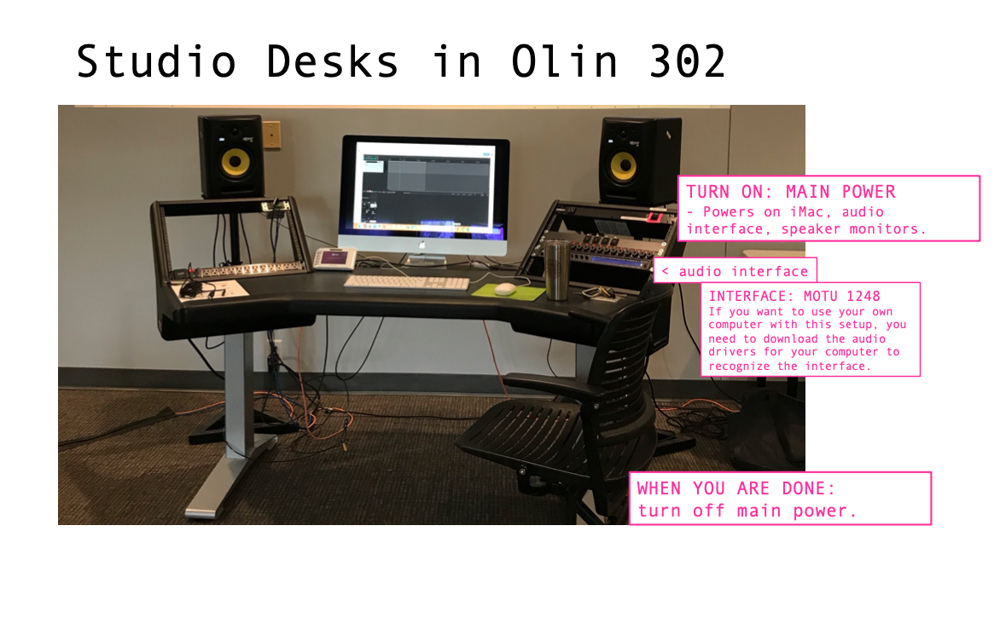

---
# Feel free to add content and custom Front Matter to this file.
# To modify the layout, see https://jekyllrb.com/docs/themes/#overriding-theme-defaults

# layout: archive
layout: single   
title: Studio   
lang: en   
ref: sched   
permalink: /studio/   
# sidebar:
#   nav: "schedule-toc"   
toc: true  
toc_label: "Studio" # default: Content
toc_icon: "bell"  # corr esponding Font Awesome icon name without the "fa" prefix
toc_sticky: true   # enables sticky toc 
read_time: true  
date: 2025-08-25  
last_modified_at: 2025-08-25  

---

## Studio Calendar   

If you are enrolled in MUS218A, you will receive access to the following calendar. Students can use this calendar to reserve time in the **Bates Sound Studio**, located in room 302 of the [Olin Arts Center.](https://www.bates.edu/music/about/olin-arts-center/){:target="_blank"}   

<iframe src="https://calendar.google.com/calendar/embed?height=600&wkst=1&ctz=America%2FNew_York&showPrint=0&src=Y19jMDZlMmFjNzlkOGM1NmY1MmEzYmVkNWI4MmE5YjlhM2NlNDZiZGIyOGM2NjgzZThkOTAzMzRhMmYxNjBlZmFlQGdyb3VwLmNhbGVuZGFyLmdvb2dsZS5jb20&src=YmF0ZXMuZWR1X2hxNTgwbGZ0aHA1N3U0Ym9sazA1b3NrZ2JzQGdyb3VwLmNhbGVuZGFyLmdvb2dsZS5jb20&src=Y19obGFjNzB1bDEwcjB1dnNtZzljZWQydnY2OEBncm91cC5jYWxlbmRhci5nb29nbGUuY29t&src=ZW4udXNhI2hvbGlkYXlAZ3JvdXAudi5jYWxlbmRhci5nb29nbGUuY29t&color=%23f09300&color=%23a79b8e&color=%23ad1457&color=%230b8043" style="border:solid 1px #777" width="800" height="600" frameborder="0" scrolling="no"></iframe>

## Work Stations

## Full-Audio Support              

Work stations in the Bates Sound Studio equipped with full audio support are located in 3 places:   

1. the "mainspace" iMac at the front of the studio (under the projection screen)  
2. Studio A      
3. Studio B      

They look like this:    

These stations with full audio support are best used for recording and mixing. If you do not need full support, please try to leave these stations open to those who may need them. Of course, if no one else is using them, reserve time at these stations and make ample use of access to a high quality audio system!    

### Using Your Own Computer

As the photo shows, [download MOTU Audio Drivers](https://motu.com/en-us/download/product/313/){:target="_blank"} to your own laptop if you'd like to connect your device to the speaker system. Ensure you've downloaded and installed the driver that corresponds with your computer's operating system.    

### Help Documents  

If you're unsure how to use these work stations, consult the following resources:    

1. [Studio Help Docs](https://docs.google.com/document/d/1nyS0aFNc3QvlNtMQjBddnNZ-yPoDga3vsXR-17NYYYg/edit?usp=sharing){:target="_blank"}, and    
2. [the MOTU 1248 Audio Interface Manual](chrome-extension://efaidnbmnnnibpcajpcglclefindmkaj/https://s3.amazonaws.com/motu-www-data/manuals/avb/1248_8M_16A_Switch_User_Guide.pdf){:target="_blank"}. 

If you're unable to resolve a problem that comes up, contact the instructor and studio assistant for additional questions.    

## Other Work Stations   

### Sound Studio Macs    

Additionally, we have 3 studio computers equipped with our studio software, located at the back of the room. 2 of them are iMacs, and the last one is a Mac Studio. You can work on these stations with headphones, but they do not have audio interfaces or monitor speakers. 

These are great stations for synthesis, spectral editing, Max patching, video, or multimedia software.       

### DMS iMac Lab       

If we are running short on space or if there are a lot of sign-outs at a time when you need a computer, you can also work on similar stations in the [Digital Media Studio iMac lab](https://www.bates.edu/digital-media/){:target="_blank"}. 

